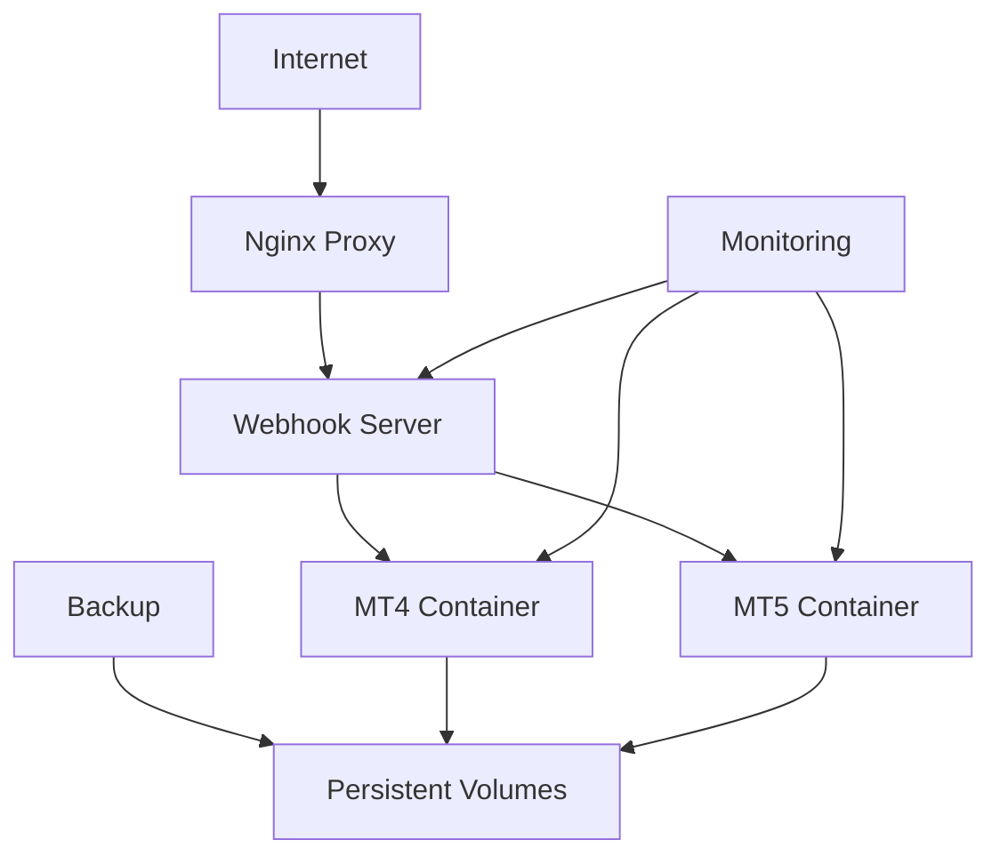

# 🚀 VPS Docker Containerization for AI Trading Expert Advisor

## 🎯 Overview

This directory contains everything needed to deploy the AI Trading Expert Advisor in a containerized VPS environment, supporting both MetaTrader 4 and MetaTrader 5 platforms.

## 📋 What's Included

### 🐳 Container Images
- **MetaTrader 4 Container**: Complete MT4 setup with Wine and X11
- **MetaTrader 5 Container**: Complete MT5 setup with Wine and X11
- **Webhook Server Container**: Python Flask server for signal processing
- **Nginx Proxy Container**: SSL termination and load balancing
- **Monitoring Stack**: Grafana, Prometheus for system monitoring

### 🛡️ Security Features
- SSL/TLS encryption with automatic certificate renewal
- Network isolation between containers
- Health checks and auto-restart capabilities
- Secure configuration management
- VPN-ready networking

### ⚙️ VPS Optimizations
- Resource-efficient Wine configuration
- Headless X11 server for GUI applications
- Persistent data volumes for EA settings
- Log aggregation and rotation
- Backup and restore scripts

## 🚀 Quick Deployment

### Prerequisites
- VPS with Docker and Docker Compose
- Minimum 4GB RAM, 2 CPU cores
- Ubuntu 20.04+ or CentOS 8+
- Domain name (optional, for SSL)

### One-Command Setup
```bash
# Clone repository
git clone https://github.com/xnox-me/DEA.git
cd DEA/VPS-Docker

# Deploy everything
./deploy.sh --platform mt5 --domain your-domain.com
```

### Manual Setup
```bash
# 1. Copy your EA files
cp ../MQL5/* ./mt5-container/MQL5/Experts/

# 2. Configure environment
cp .env.example .env
nano .env  # Edit your settings

# 3. Start containers
docker-compose up -d

# 4. Check status
docker-compose ps
```

## 📊 Container Architecture



## 🔧 Configuration

### Environment Variables (.env)
```env
# Trading Configuration
MT_PLATFORM=MT5                    # MT4 or MT5
BROKER_SERVER=YourBroker-Server     # Broker server
ACCOUNT_NUMBER=12345678             # Account number
ACCOUNT_PASSWORD=your_password       # Account password

# Webhook Configuration
WEBHOOK_PORT=5000                   # Webhook server port
WEBHOOK_TOKEN=your_secret_token     # Authentication token
SSL_DOMAIN=your-domain.com          # SSL domain (optional)

# Resource Limits
MT_MEMORY_LIMIT=2g                  # MetaTrader memory limit
MT_CPU_LIMIT=1.0                    # MetaTrader CPU limit

# Monitoring
ENABLE_MONITORING=true              # Enable Grafana/Prometheus
GRAFANA_PASSWORD=admin123           # Grafana admin password
```

### Expert Advisor Configuration
```yaml
# ea-config.yaml
trading:
  enable_trading: true
  enable_ai_analysis: true
  enable_webhooks: true
  lot_size: 0.1
  risk_percent: 2.0
  max_positions: 5

ai_analysis:
  news_analysis: true
  social_sentiment: true
  confidence_threshold: 0.7

risk_management:
  max_drawdown: 10.0
  trailing_stop: true
  emergency_stop: true
```

## 🎛️ Management Commands

### Container Management
```bash
# Start services
./scripts/start.sh

# Stop services
./scripts/stop.sh

# Restart specific service
./scripts/restart.sh mt5-container

# View logs
./scripts/logs.sh mt5-container

# Update EA files
./scripts/update-ea.sh --platform mt5
```

### Backup & Restore
```bash
# Backup all data
./scripts/backup.sh --output /backup/ea-backup-$(date +%Y%m%d)

# Restore from backup
./scripts/restore.sh --input /backup/ea-backup-20250826

# Schedule automated backups
./scripts/setup-cron-backup.sh
```

### Monitoring
```bash
# Check system health
./scripts/health-check.sh

# View performance metrics
./scripts/metrics.sh

# Generate reports
./scripts/generate-report.sh --period 7d
```

## 🖥️ Access Points

### Web Interfaces
- **Grafana Dashboard**: `https://your-domain.com:3000`
- **Webhook Health**: `https://your-domain.com:5000/health`
- **System Status**: `https://your-domain.com:8080/status`

### Remote Access
```bash
# VNC to MT4/MT5 (if enabled)
vncviewer your-vps-ip:5901

# SSH tunnel for secure access
ssh -L 5901:localhost:5901 user@your-vps-ip
```

## 📈 Performance Optimization

### Resource Tuning
```bash
# Optimize for high-frequency trading
./scripts/optimize-performance.sh --mode hft

# Optimize for multiple pairs
./scripts/optimize-performance.sh --mode multi-pair

# Low-resource VPS optimization
./scripts/optimize-performance.sh --mode low-resource
```

### Network Optimization
```bash
# Enable connection pooling
docker-compose exec webhook-server python optimize_connections.py

# Configure trade server priorities
./scripts/configure-network-priority.sh
```

## 🛡️ Security Hardening

### SSL Configuration
```bash
# Generate SSL certificates
./scripts/generate-ssl.sh your-domain.com

# Renew certificates (automated)
./scripts/renew-ssl.sh

# Force HTTPS redirect
./scripts/enforce-https.sh
```

### Access Control
```bash
# Setup IP whitelisting
./scripts/whitelist-ip.sh 203.0.113.1

# Configure VPN access
./scripts/setup-vpn.sh

# Enable 2FA for containers
./scripts/enable-2fa.sh
```

## 🔍 Troubleshooting

### Common Issues
```bash
# MetaTrader won't start
./scripts/troubleshoot.sh --issue mt-startup

# Webhook connection problems
./scripts/troubleshoot.sh --issue webhook-connection

# Performance issues
./scripts/troubleshoot.sh --issue performance

# SSL certificate problems
./scripts/troubleshoot.sh --issue ssl
```

### Log Analysis
```bash
# Aggregate all logs
./scripts/collect-logs.sh

# Analyze trading performance
./scripts/analyze-trades.sh --period 24h

# Check system resources
./scripts/resource-monitor.sh
```

## 📊 Monitoring & Alerts

### Grafana Dashboards
- **Trading Performance**: Win rates, P&L, drawdown
- **System Resources**: CPU, memory, network usage
- **EA Health**: Signal processing, AI analysis status
- **Risk Metrics**: Position exposure, correlation analysis

### Alert Configuration
```yaml
# alerts.yaml
alerts:
  - name: High Drawdown Alert
    condition: drawdown > 5%
    action: email, telegram
  
  - name: Connection Lost Alert
    condition: mt_connection == false
    action: restart_container, email
  
  - name: Performance Degradation
    condition: latency > 2s
    action: optimize, alert
```

## 🚀 Scaling & Load Balancing

### Multi-Account Setup
```bash
# Deploy multiple trading accounts
./scripts/deploy-multi-account.sh --accounts 5

# Load balance webhook signals
./scripts/setup-load-balancer.sh

# Manage account allocation
./scripts/manage-accounts.sh --add-account 12345678
```

### High Availability
```bash
# Setup cluster mode
./scripts/setup-cluster.sh --nodes 3

# Enable failover
./scripts/enable-failover.sh --backup-node node2

# Database replication
./scripts/setup-db-replication.sh
```

## 📋 Maintenance

### Updates
```bash
# Update EA to latest version
./scripts/update.sh --component ea

# Update container images
./scripts/update.sh --component containers

# Full system update
./scripts/update.sh --full
```

### Health Monitoring
```bash
# Daily health report
./scripts/daily-report.sh

# Weekly performance analysis
./scripts/weekly-analysis.sh

# Monthly optimization review
./scripts/monthly-optimization.sh
```

## 🎯 Best Practices

### VPS Selection
- **CPU**: Minimum 2 cores, 4+ recommended
- **RAM**: Minimum 4GB, 8GB+ for multiple pairs
- **Storage**: SSD preferred, minimum 50GB
- **Network**: Low latency to broker servers
- **Location**: Close to broker data centers

### Security
- Regular security updates
- Strong authentication
- Network isolation
- Encrypted communications
- Regular backups

### Performance
- Monitor resource usage
- Optimize EA parameters
- Regular performance reviews
- Proactive maintenance

---

**🚀 Ready to deploy your AI Trading Expert Advisor on any VPS!**

For support and advanced configurations, see the detailed guides in each subdirectory.