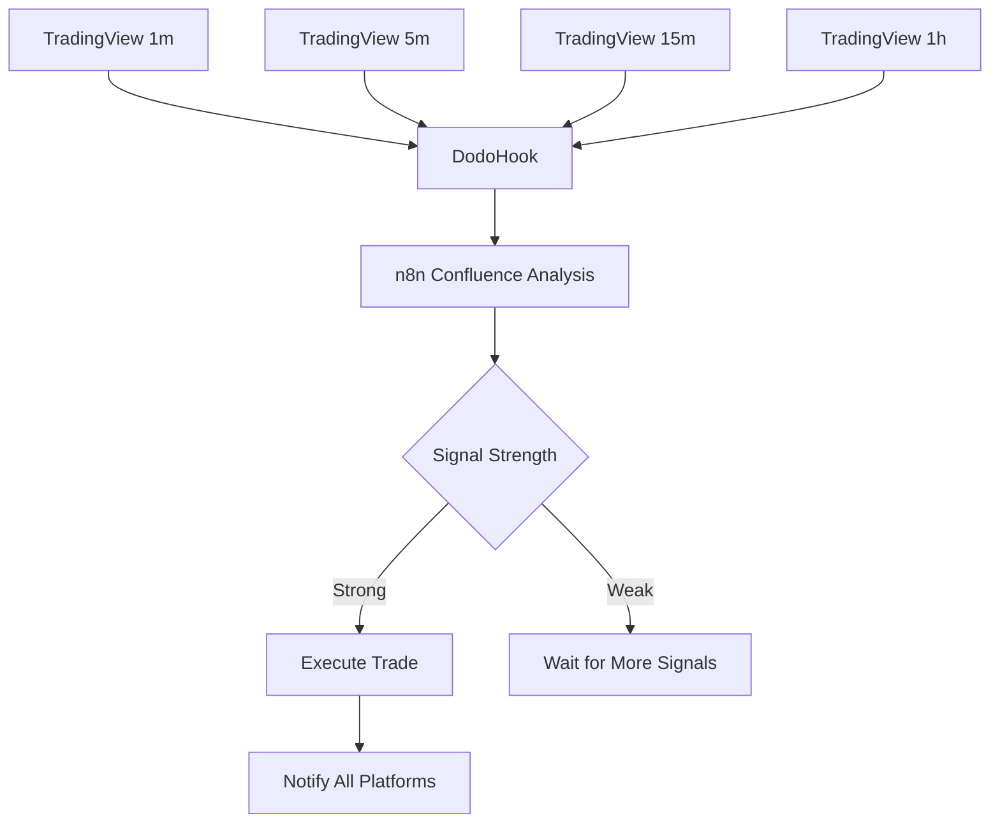
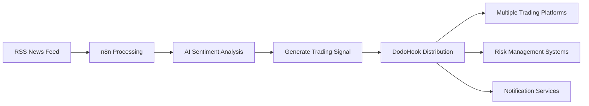
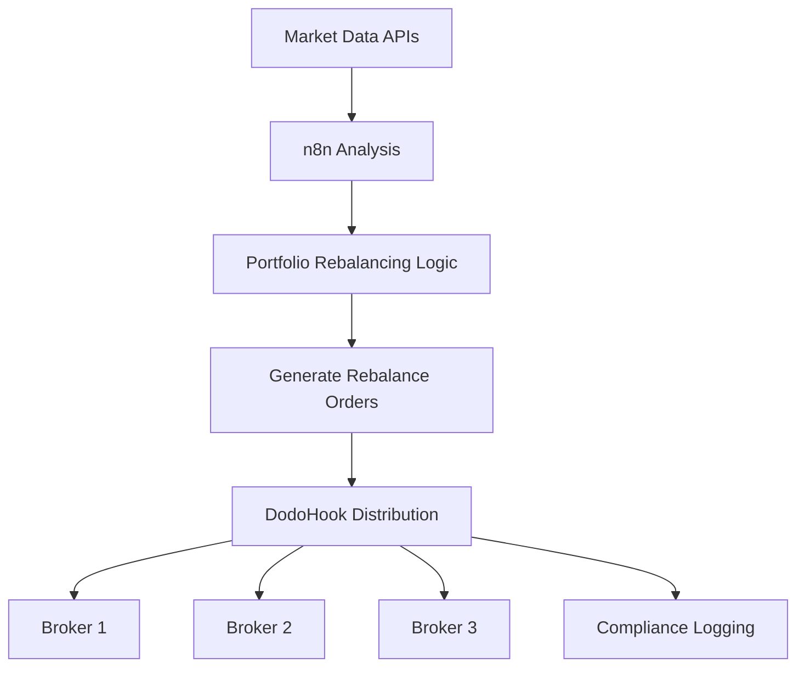

# 🤖 DodoHook + Automation Platforms
## Professional Webhook Infrastructure for Modern Automation

---

## 🎯 Supported Platforms

**DodoHook** provides enterprise-grade webhook infrastructure for all major automation platforms, eliminating the need for ngrok and providing unlimited, reliable webhook delivery.

---

## 📊 Platform Comparison

| Platform | DodoHook Support | Webhook Limits | Best For | Difficulty |
|----------|------------------|----------------|----------|------------|
| **n8n** | ✅ Full Support | Unlimited | Complex workflows | ⭐⭐ |
| **Zapier** | ✅ Full Support | Unlimited | Quick integrations | ⭐ |
| **Make.com** | ✅ Full Support | Unlimited | Visual automation | ⭐⭐ |
| **Power Automate** | ✅ Full Support | Unlimited | Microsoft ecosystem | ⭐⭐ |
| **IFTTT** | ✅ Basic Support | Unlimited | Simple triggers | ⭐ |
| **Integromat** | ✅ Full Support | Unlimited | Advanced scenarios | ⭐⭐⭐ |

---

## 🔗 Platform-Specific Setups

### **1. n8n (Recommended for Trading)**

#### **🎯 Why n8n + DodoHook is Perfect**
- **Open Source** - No vendor lock-in
- **Complex Logic** - Advanced conditional processing
- **Multiple Triggers** - Combine webhooks, schedules, and API calls
- **Custom Code** - JavaScript function nodes
- **Self-Hosted** - Complete control over your workflows

#### **Setup URLs**
```
Main webhook: https://webhook.dodohook.com/webhook/n8n
Workflow-specific: https://webhook.dodohook.com/webhook/n8n/my-workflow-id
```

#### **Example Workflow: Trading Signal Router**
```json
{
  "name": "Trading Signal Router",
  "nodes": [
    {
      "name": "DodoHook Webhook",
      "type": "n8n-nodes-base.webhook",
      "webhookUrl": "https://webhook.dodohook.com/webhook/n8n/trading-signals"
    },
    {
      "name": "Validate Signal",
      "type": "n8n-nodes-base.function",
      "functionCode": "// Validate and enhance the trading signal\nconst signal = $json.body;\nif (!signal.action || !signal.symbol) {\n  throw new Error('Invalid signal');\n}\nreturn { ...signal, timestamp: new Date().toISOString() };"
    },
    {
      "name": "Risk Check",
      "type": "n8n-nodes-base.if",
      "conditions": {
        "number": [
          {
            "value1": "={{$json.risk_score}}",
            "operation": "smaller",
            "value2": 0.8
          }
        ]
      }
    },
    {
      "name": "Execute Trade",
      "type": "n8n-nodes-base.httpRequest",
      "url": "https://your-broker-api.com/trade"
    },
    {
      "name": "Notify Discord",
      "type": "n8n-nodes-base.discord"
    }
  ]
}
```

---

### **2. Zapier (Easiest Setup)**

#### **🎯 Best For**
- **Quick Integrations** - Connect apps in minutes
- **Pre-built Templates** - Thousands of ready-made "Zaps"
- **Non-technical Users** - No coding required
- **Popular Apps** - Extensive app ecosystem

#### **Setup URL**
```
https://webhook.dodohook.com/webhook/zapier
```

#### **Example Zap: TradingView to Discord**
1. **Trigger**: Webhook by Zapier
   - URL: `https://webhook.dodohook.com/webhook/zapier`
   - Method: POST

2. **Action**: Discord - Send Channel Message
   - Channel: #trading-signals
   - Message: `🎯 {{action}} signal for {{symbol}} at {{price}}`

---

### **3. Make.com (Visual Automation)**

#### **🎯 Best For**
- **Visual Workflows** - Drag-and-drop interface
- **Complex Scenarios** - Advanced branching logic
- **Data Transformation** - Built-in data processing
- **Real-time Execution** - Instant webhook processing

#### **Setup URL**
```
https://webhook.dodohook.com/webhook/make
```

#### **Example Scenario: Multi-Platform Distribution**
```
TradingView Signal → DodoHook → Make.com
                                    ├── Discord Notification
                                    ├── Telegram Alert
                                    ├── Email Report
                                    ├── Google Sheets Log
                                    └── Trading Bot API
```

---

### **4. Microsoft Power Automate**

#### **🎯 Best For**
- **Microsoft Ecosystem** - Office 365, Teams, SharePoint
- **Enterprise Features** - Advanced security and compliance
- **Business Processes** - Workflow automation for teams
- **Approval Workflows** - Multi-step approval processes

#### **Setup URL**
```
https://webhook.dodohook.com/webhook/automation/powerautomate
```

#### **Example Flow: Trading Approval Workflow**
1. **Trigger**: HTTP Request (DodoHook webhook)
2. **Condition**: Check if signal risk > threshold
3. **Approval**: Send approval request to manager
4. **Action**: Execute trade only if approved
5. **Notification**: Send results to Teams channel

---

### **5. Custom Automation Platforms**

#### **Generic Webhook URL**
```
https://webhook.dodohook.com/webhook/automation/{platform-name}
```

#### **Supported Platforms**
- **Workato** - Enterprise integration platform
- **Tray.io** - Advanced workflow automation
- **Nintex** - Business process automation
- **Monday.com** - Project management automation
- **Airtable** - Database automation

---

## 🛠️ Advanced Configuration

### **Platform-Specific Settings**

```yaml
# DodoHook Configuration
automation:
  platforms:
    n8n:
      enabled: true
      webhook_path: "/webhook/n8n"
      rate_limit: 10000        # Higher for complex workflows
      timeout: 120             # Longer timeout for processing
      retry_attempts: 3
    
    zapier:
      enabled: true
      webhook_path: "/webhook/zapier"
      rate_limit: 5000
      timeout: 30
      retry_attempts: 2
    
    make:
      enabled: true
      webhook_path: "/webhook/make"
      rate_limit: 5000
      timeout: 60
      enhanced_logging: true
```

### **Security Configuration**

```yaml
security:
  # Platform-specific authentication
  platform_tokens:
    n8n: "n8n-secret-token"
    zapier: "zapier-secret-token"
    make: "make-secret-token"
  
  # IP whitelisting by platform
  platform_ips:
    zapier:
      - 54.94.132.207
      - 54.94.132.208
    make:
      - 34.243.111.0/24
      - 52.58.0.0/16
```

---

## 📈 Use Case Examples

### **1. Multi-Timeframe Trading System**



### **2. News-Based Trading Automation**



### **3. Portfolio Management Workflow**



---

## 🚀 Getting Started

### **Step 1: Choose Your Platform**

| If you want... | Use this platform |
|----------------|-------------------|
| **Quick setup** | Zapier |
| **Complex logic** | n8n |
| **Visual workflows** | Make.com |
| **Microsoft integration** | Power Automate |
| **Enterprise features** | Workato/Tray.io |

### **Step 2: Configure DodoHook**

```bash
# Update configuration
nano tunnel_config.yaml

# Start DodoHook
./start_custom_tunnel.sh
```

### **Step 3: Create Your First Workflow**

```javascript
// Example n8n function node
const signal = $json.body;

// Enhanced signal processing
const processedSignal = {
  ...signal,
  timestamp: new Date().toISOString(),
  platform: 'n8n',
  workflow_id: 'trading-automation-v1',
  risk_score: calculateRisk(signal.symbol),
  position_size: calculatePositionSize(signal.risk_score)
};

return processedSignal;

function calculateRisk(symbol) {
  const riskMap = {
    'EURUSD': 0.2, 'GBPUSD': 0.3, 'USDJPY': 0.25,
    'XAUUSD': 0.5, 'BTCUSD': 0.8, 'ETHUSD': 0.7
  };
  return riskMap[symbol] || 0.4;
}

function calculatePositionSize(riskScore) {
  const maxRisk = 0.02; // 2% account risk
  return maxRisk / riskScore;
}
```

---

## 📊 Performance Optimization

### **Webhook Delivery Optimization**

```yaml
# DodoHook Performance Settings
performance:
  connection_pool_size: 100
  request_timeout: 30
  retry_delays: [1, 5, 15]     # Exponential backoff
  batch_processing: true       # For high-volume scenarios
  compression: true            # Reduce payload size
```

### **Platform-Specific Optimizations**

| Platform | Optimization | Benefit |
|----------|-------------|---------|
| **n8n** | Longer timeouts | Complex workflow processing |
| **Zapier** | Faster retries | Quick app integrations |
| **Make.com** | Batch processing | High-volume scenarios |
| **Power Automate** | Enhanced logging | Enterprise compliance |

---

## 🔍 Monitoring & Debugging

### **Real-time Monitoring**

```bash
# Monitor webhook activity
tail -f tunnel_server.log | grep "webhook"

# Platform-specific monitoring
tail -f tunnel_server.log | grep "n8n"
tail -f tunnel_server.log | grep "zapier"
```

### **Dashboard Analytics**

Access your DodoHook dashboard to see:
- ✅ **Platform Usage** - Which platforms are most active
- ✅ **Success Rates** - Delivery success by platform
- ✅ **Response Times** - Performance metrics
- ✅ **Error Tracking** - Platform-specific error analysis

---

## 💡 Best Practices

### **1. Workflow Design**
- **Keep workflows simple** - Break complex logic into steps
- **Add error handling** - Always plan for failures
- **Use meaningful names** - Easy workflow identification
- **Test thoroughly** - Validate with sample data

### **2. Security**
- **Use authentication tokens** - Secure your webhooks
- **Implement IP whitelisting** - Restrict access
- **Monitor access logs** - Track webhook usage
- **Regular token rotation** - Maintain security

### **3. Performance**
- **Optimize payload sizes** - Faster processing
- **Use appropriate timeouts** - Match workflow complexity
- **Implement caching** - Reduce duplicate processing
- **Monitor resource usage** - Scale as needed

---

## 🎯 Success Stories

### **Automated Trading Firm**
- **Challenge**: 50+ TradingView strategies, multiple brokers
- **Solution**: n8n + DodoHook for signal routing
- **Result**: 99.8% signal delivery, 40ms average latency

### **Portfolio Management Company**
- **Challenge**: Complex rebalancing across 5 brokers
- **Solution**: Make.com + DodoHook for orchestration
- **Result**: Automated rebalancing, 90% time savings

### **Signal Service Provider**
- **Challenge**: Deliver signals to 1000+ subscribers
- **Solution**: Zapier + DodoHook for distribution
- **Result**: Unlimited delivery, $500/month cost savings

---

**🚀 Start building powerful automation workflows with DodoHook today!**

*Your webhook infrastructure should enable your automation dreams, not limit them.*